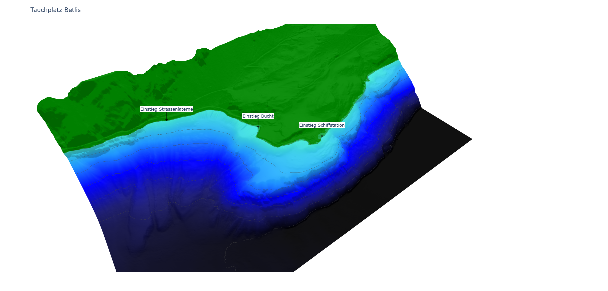

# Underwater-Maps

This repository contains a [Dash](https://dash.plotly.com/) web application that displays a 3D surface plot of dive sites in Switzerland. The application is containerized with Docker.

## Build and run

The Docker container can be build with the `dockerfile` or can be pulled from [Docker Hub](https://hub.docker.com/r/chif142/uw_maps). To run the container the port 8050 must be published.

## Structure

### [Maps](./maps/)

In this folder are 2D contour maps of the divesites. The PDF can be downloaded directly or created with the python script.

### [npy Data](./npy_data/)

Here are the raw elevation data of the divesites as `.npy` files.

### [Process Data](./process_data/)

Helper files to convert the csv files from the [Federal Office of Topography swisstopo](https://www.swisstopo.admin.ch/) to the `.npy` files. Since i haven't implemented their api in my code the csv files must be [downloaded directly by swisstopo](https://www.swisstopo.admin.ch/en/geodata/height.html).

### [Sources](./src/)

The source files for the Dash application. Every divesite has a singleton where all data is stored for the web-app.

## License and Acknowledgment

This code is licensed under [GLP](https://www.gnu.org/licenses). The raw data come from the Federal Office of Topography swisstopo where their [terms of use](https://www.swisstopo.admin.ch/en/home/meta/conditions/geodata/ogd.html) applied.
